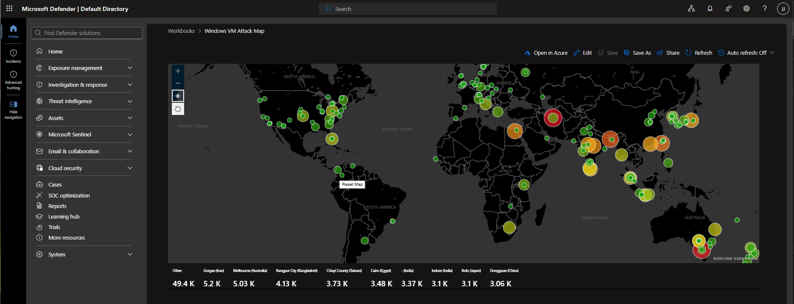
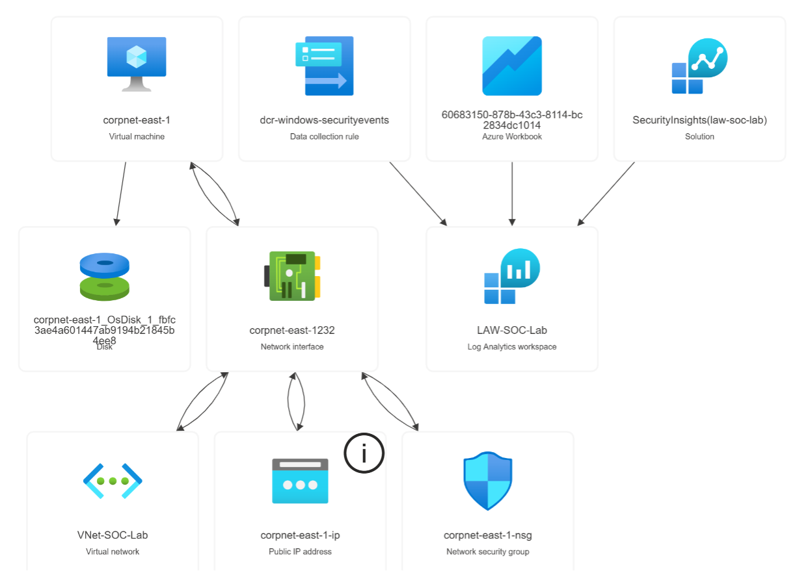
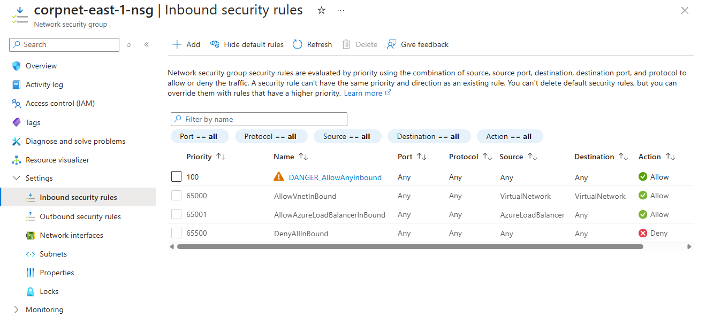
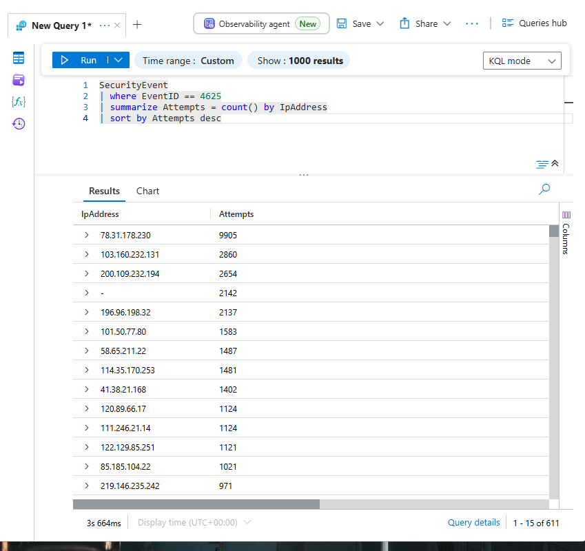
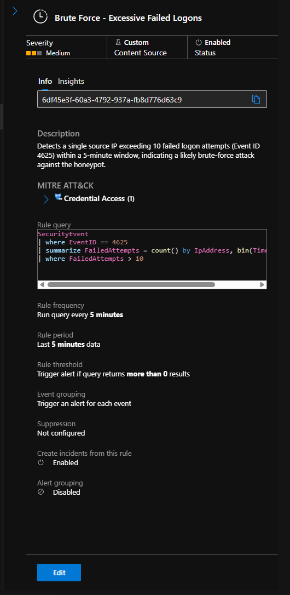
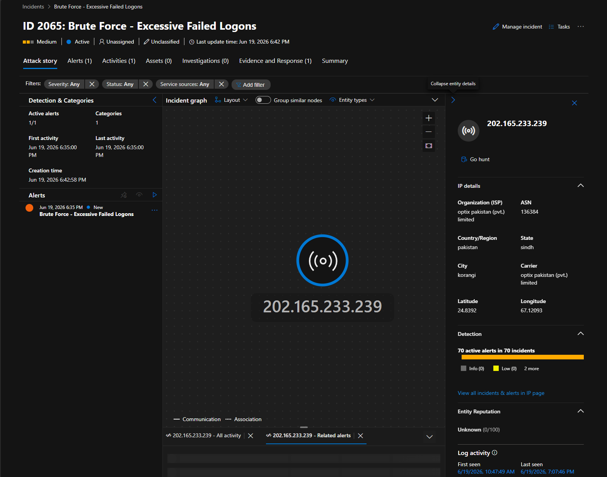
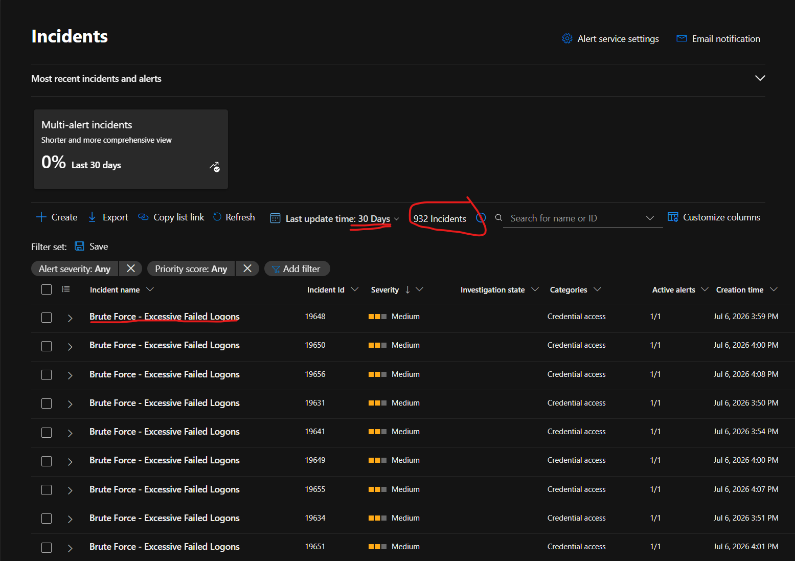

# Azure SOC Honeynet + Microsoft Sentinel Attack Map
> An exposed Windows honeypot in Azure, wired into Sentinel, turning raw failed logons into a live attack map and an automated brute-force detection.

 


 
---
 
## Overview
 
I put a Windows Server VM on the public internet with the firewalls open to see what would actually hit it. Within hours it was under constant automated attack.
 
From there I built the rest of the SOC pipeline: Security logs into a Log Analytics workspace, Sentinel on top of it, KQL to enrich failed logons with geolocation, a workbook to map them, and a scheduled analytics rule that opens an incident when an IP starts brute-forcing.
 
**In ~25 hours:** 42,824 failed logons from 618 unique IPs across 63 countries, and 932 incidents raised by the detection rule.
 
---
 
## Architecture


 
| Resource | Type | What it does |
|---|---|---|
| `corpnet-east-1` | Virtual machine | The honeypot. Windows Server 2025, `D2s_v3`, host firewall off. |
| `corpnet-east-1-nsg` | Network security group | Cloud firewall, set to allow all inbound so the box gets found. |
| `corpnet-east-1-ip` | Public IP address | The routable address attackers reached. |
| `corpnet-east-1232` | Network interface | Connects the VM to the VNet and public IP. |
| `VNet-SOC-Lab` | Virtual network | The network the VM sits on. |
| `corpnet-east-1_OsDisk_1` | Disk | VM operating system disk. |
| `dcr-windows-securityevents` | Data collection rule | Defines which events get collected and where they're sent. |
| `LAW-SOC-Lab` | Log Analytics workspace | Stores the events in the `SecurityEvent` table. |
| `SecurityInsights(law-soc-lab)` | Solution | Microsoft Sentinel, running on the workspace. |
| `60683150-878b-43c3...` | Azure Workbook | The attack map. Displays under its GUID in the portal. |
 
Data path: VM → Azure Monitor Agent → data collection rule → workspace → Sentinel → workbook and analytics rule.
 
---
 
## How it was built
 
### 1. Expose the honeypot
 
Built `RG-SOC-Lab`, a VNet, and a Windows Server 2025 VM (`D2s_v3`) in East US 2. I replaced the default RDP-only NSG rule with allow-any inbound at priority 100, above Azure's default deny, then turned off the host firewall so there'd be no ambiguity about why the box might not be getting hit.
 

 
### 2. Build the logging pipeline
 
Log Analytics workspace, Sentinel enabled on it, Windows Security Events connector installed, and the VM connected through the Azure Monitor Agent and a Data Collection Rule scoped to all Security events.
 
### 3. Query the attacks
 
KQL to isolate failed logons ([`kql/01-failed-logons.kql`](kql/01-failed-logons.kql)) and count them per source IP ([`kql/02-failed-logons-by-ip.kql`](kql/02-failed-logons-by-ip.kql)). These come straight off the raw table with no lookups, which is what makes them the reference point everything else gets checked against.
 

 
### 4. Enrich and visualize
 
The logs carry an attacker IP but no location, so I uploaded a geoip watchlist and resolved each IP through `ipv4_lookup` ([`kql/03-geoip-enrichment.kql`](kql/03-geoip-enrichment.kql)), then plotted volume by location in a workbook ([`kql/04-attack-map.kql`](kql/04-attack-map.kql)). This is the part I got wrong the first time.
 
---
 
## Findings
 
| Rank | Country | Failed Attempts | Unique IPs |
|------|---------|-----------------|------------|
| 1 | Russia | 9,926 | 5 |
| 2 | India | 5,170 | 47 |
| 3 | Pakistan | 4,964 | 9 |
| 4 | Venezuela | 2,654 | 1 |
| 5 | Taiwan | 2,628 | 5 |
| 6 | China | 2,594 | 124 |
| 7 | Egypt | 2,486 | 21 |
| 8 | Kenya | 2,159 | 3 |
 
*63 countries, 618 attacker IPs, 42,824 failed logons over ~25 hours. Full breakdown in [`data/country-totals.csv`](data/country-totals.csv). Excludes 2,153 events with no source IP, which Windows records for local and console failures.*
 
Volume rank and attacker count disagree sharply. Russia leads on volume from 5 IPs, one of which (`78.31.178.230`) is 23% of all traffic by itself, while China has 124 distinct IPs and ranks 6th. A map sized by volume shows persistence; sized by unique sources it would show breadth.
 
### Catching the bad enrichment
 
My first version of this table had Malaysia on top with 4,992 attempts and Australia behind it at 4,564. Against the same raw events, those two account for 8 and 10 attempts. Neither was ever a real source.
 
The geoip watchlist had overlapping IP ranges, so one attacker IP sits inside several network blocks and `ipv4_lookup` fans the join out into multiple rows. That inflates counts, and since the query keeps whichever match it grabs first, the country it lands on is close to arbitrary. The attacks weren't only overcounted, they were pinned to the wrong places on the map.
 
Comparing enriched counts against raw ones per IP gave it away ([`kql/06-join-inflation-check.kql`](kql/06-join-inflation-check.kql)): one IP came back with more rows after the join than the raw table held, which can't happen if the join is behaving. I rebuilt the totals offline against an independent IP-to-country database ([`scripts/geo-enrich-offline.py`](scripts/geo-enrich-offline.py)), so they no longer depend on the watchlist.
 
What sticks with me is how I reacted at the time. Malaysia and Australia on top seemed surprising, so I wrote a paragraph about geo-IP showing where attacking infrastructure sits rather than where attackers are. That's true, and it let a broken number sit in my README looking thoughtful.
 
---
 
## Detection logic
 
The rule ([`detection-rules/brute-force-failed-logons.json`](detection-rules/brute-force-failed-logons.json)) maps to MITRE ATT&CK **T1110 (Brute Force)** under Credential Access:
 
```kusto
SecurityEvent
| where EventID == 4625
| summarize FailedAttempts = count() by IpAddress, bin(TimeGenerated, 5m)
| where FailedAttempts > 10
```
 

 
Runs every 5 minutes over a 5-minute lookback. Event grouping triggers per event rather than bundling, so each attacking IP opens its own incident instead of several unrelated attackers landing in one alert. Mapping the IP as an entity is what makes those incidents worth opening, since you get ISP, ASN, location, and other incidents tied to the same source.
 

 
It raised 932 incidents. The rule reads `SecurityEvent` directly and never joins the watchlist, so the enrichment bug left it alone.
 

 
---
 
## Problems I hit
 
| Problem | Cause | Fix |
|---|---|---|
| Windows 11 image rejected: *"requires a subscription without any spending limit"* | Client-image licensing restriction tied to the spending-limit flag on student subscriptions | Used Windows Server 2025 Datacenter. Same Security log, same 4625 events. |
| `QuotaExceeded` deploying a B-series VM | Student subscriptions default many VM families to 0 quota per region, and zone-pinned VMs draw from a narrower pool | Set availability to no infrastructure redundancy and deployed `D2s_v3`. |
| Enriched counts higher than raw, countries misattributed | Overlapping ranges in the geoip watchlist fan out the `ipv4_lookup` join | Rebuilt totals from raw per-IP counts against an independent geo database. |
| Several attacker IPs collapsing into one incident | Event grouping defaults to a single alert per rule run | Switched to trigger per event, so each IP is independently investigable. |
